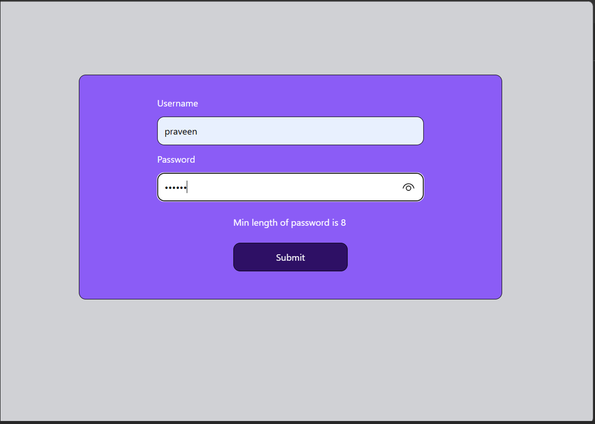

# React Hook Form Validation Project

A simple full-stack form validation project built using React Hook Form, Tailwind CSS, and Express.js. This project demonstrates client-side form validation, asynchronous form submission, and frontend-backend communication using the Fetch API.

---

## 🚀 Features

### Client-Side Validation

#### Username Validation

* Required field validation
* Minimum length: 3 characters
* Maximum length: 15 characters

#### Password Validation

* Required field validation
* Minimum length: 8 characters
* Maximum length: 15 characters

### Additional Features

* Loading state during form submission
* Disabled submit button while request is processing
* React Hook Form integration
* Async form submission handling
* Frontend to backend communication using Fetch API
* Express.js backend setup
* CORS configuration
* JSON request handling

---

## 🛠️ Tech Stack

### Frontend

* React
* React DOM
* React Hook Form
* Tailwind CSS
* Vite

### Backend

* Node.js
* Express
* CORS
* Body Parser

---

## 📦 Dependencies

### Frontend

* React
* React DOM
* React Hook Form

### Backend

* Express
* CORS
* Body Parser

---

## 📂 Project Structure

```bash
video 119/
│
├── src/
│   ├── App.jsx
│   ├── main.jsx
│   └── index.css
│
├── backend/
│   └── server.js
│
├── package.json
└── README.md
```

---

## ⚙️ Installation

### Clone the Repository

```bash
git clone https://github.com/praveen-maurya1/Sigma-Web-Development-with-CodeWithHarry.git
```

### Navigate to the Project Folder

```bash
cd "video 119"
```

### Install Dependencies

```bash
npm install
```

### Start the Frontend

```bash
npm run dev
```

### Start the Backend

```bash
cd backend
nodemon server.js
```

---

## 🔄 How It Works

1. The user enters a username and password.
2. React Hook Form validates the inputs.
3. Validation errors are displayed instantly.
4. The form data is sent to the Express backend using the Fetch API.
5. The backend receives and processes the request.
6. A loading state is shown while the request is being submitted.
7. The submit button remains disabled until the request is completed.

---

## 📚 Learning Outcomes

Through this project, I learned:

* Form handling with React Hook Form
* Client-side form validation in React
* Managing loading states using `isSubmitting`
* Handling asynchronous requests
* Sending data using the Fetch API
* Connecting a React frontend with an Express backend
* Working with JSON data
* Configuring CORS in Express
* Building responsive user interfaces with Tailwind CSS

---

## 📸 Project Preview

### Form UI




---

## 🔗 Repository

GitHub Repository:

https://github.com/praveen-maurya1/Sigma-Web-Development-with-CodeWithHarry/tree/7ef38a181150b42a822b80052720a49f2cb5259c/video%20119

---

## 👨‍💻 Author

### Praveen Maurya

**GitHub:**
https://github.com/praveen-maurya1

**LinkedIn:**
https://www.linkedin.com/in/praveen-maurya-722a393a1

---

⭐ If you found this project helpful, consider giving it a star.
